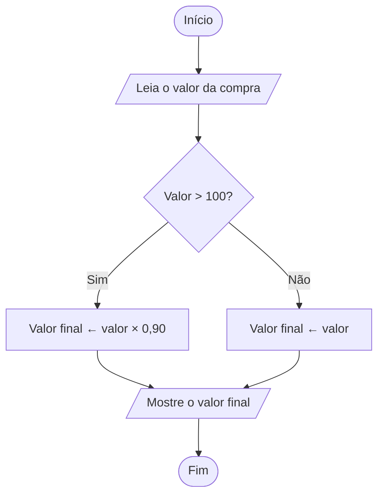

# Exercício 3 — Fluxograma

Problema: uma loja oferece desconto de 10% para compras acima de R$ 100,00.

## Explicação

- Se o valor da compra for maior que R$ 100,00, o valor final será calculado com 10% de desconto.
- Caso contrário, o valor final será igual ao valor original da compra.
